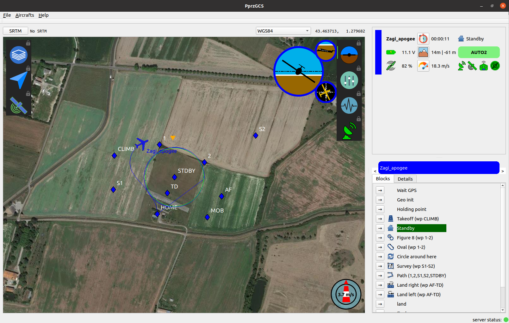

# Ground Control Station for Paparazzi UAV

GCS for [Paparazzi UAV](http://wiki.paparazziuav.org/wiki/Main_Page) in C++/QT5, aiming at replacing the historical GCS in a near future.

## INSTALLATION

### Precompiled binary

Precompilied binary is available only for Ubuntu 20.04 on amd64 architecture (intel 64 bits).

First, install the dependencies:

`sudo apt install libxml2 libzip5 libproj15 libqt5xml5 libqt5network5 libqt5svg5  libqt5texttospeech5 libqt5widgets5 libqt5gui5 libqt5core5a`

Download the `.deb` from latest release at [https://github.com/Fabien-B/PprzGCS/releases/latest](https://github.com/Fabien-B/PprzGCS/releases/latest), then install it (adjust the filename as needed) :

`sudo dpkg -i pprzgcs_*.deb`

You can now launch PprzGCS from the paparazzi center via the `Tools` menu.

### Build from sources

## Ubuntu 20.04

Install the dependencies: 

`sudo apt install libsqlite3-dev libzip-dev qtbase5-dev libqt5svg5-dev libqt5texttospeech5-dev libproj-dev mesa-common-dev libglu1-mesa-dev`

cd to the PprzGCS root, and build the needed libraries:

`./build.sh libs`

Now you should be able to build the app with:

`./build.sh app`

PprzGCS must be able to locate the **data** directory. It default to `/usr/local/share/pprzgcs/data`. You need to override it by setting the `PPRZGCS_DATA_PATH` environment variable.

Adapt this command to your path and run it:

`export PPRZGCS_DATA_PATH=/path/to/pprzgcs/data`

You can add this command to your `.bashrc` 

## Ubuntu 18.04

Follow the instructions in the [documentation](https://fabien-b.github.io/PprzGCS/developer_guide/how_to_build.html#ubuntu-18-04)

## Mac

PprzGCS can be built for Mac, although is not yet officially supported.

